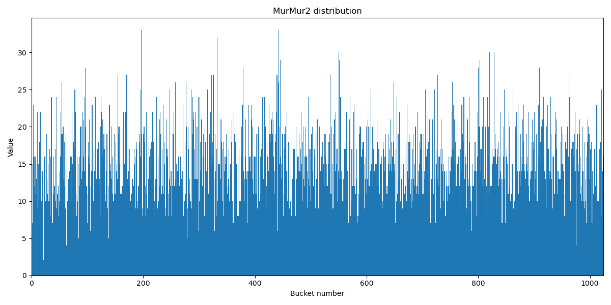
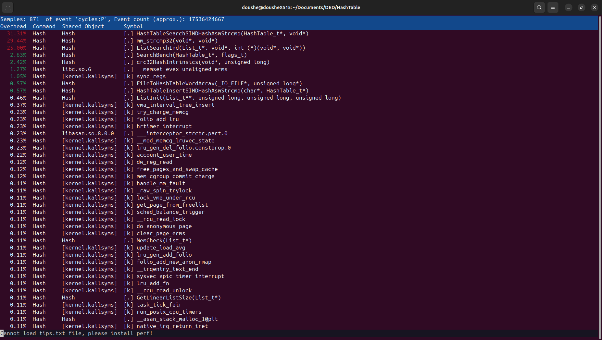

# Optimized Hash Table
This is an open adressing hash table implementation with assembly optimizations. This is an educational project, main purpose of which is to get familiar with ways of optimizing data structures and even some functions from libc via assembly inline 
code, SIMD instructions and whole functions written in assembly.
## Info
Hash functionis a function that maps arbitrary-size data to a fixed-size data, e.g. strings to integer numbers.
Hash function's effectiveness is defined by how evenly it maps output range. Ideally, every hash value from output range should have same probability.

Hash table with open adressing is a closed data structure which consists of buckets (lists with data) and dictionary. Each bucket has its own unique number that is defined by 
hash sum of elements that it contains. Each key has its own value, which can be accessed. Each bucket contains list of keys (because several keys can have same hash sum) and list of values (they can be in the same list or in two separate,
they have to be synchronized, though). 


Generally, effectiveness of a hash table is defined by number of buckets it has: if there is a bucket for every element, values can be accessed in constant time, because there is gonna be a bijection between
hash sums and keys, hence, hash sums and values. 

In modern hash tables buckets contain, on average, 1.5 elements, so  they can be organised not as lists, but as simple arrays. However, it is really hard to optimize such hash table, so, for educational purposes 
we will downgrade our hash table: it will be using only 256 buckets, which that if we would take a huge amount of keys, some of them definetely will fall into the same bucket. That downgrade will allow us to look 
for some optimizations.

This project main idea is to implement some low-level optimization such as assembly inline code, SIMD, assembly functions in open adressing hash table structure. To implement those optimizations 
we need to make our task less general and specify format and funtionality of our hash table. Those restrictions are gonna be:

1. Number of buckets is much less than number of keys, 1024 in our case (this way, with our test files Load factor will be around 10 word per bucket).
2. All compiler optimizations are gonna be disabled, programm will be running with O0.
3. Hash function is going to be extremely simple.
4. We are going to work only with ywords (arrays of linear data with maximum length of 256 bits). For better visualization we are going to use char strings, even tho our table will be able to work with any type of data within size limit.

## Low-level optimizations problems
Main problem of any low-level optimizations is that it reduces readability and compatability of program: it becomes harder to read, loses some functionality, because while implementing low-level optimizations, 
we always rely on opportunities that are specific to a task, e.g. strictly limited key size. 

Because of that we should be conscious with our optimizations, that is why they should be precise and laconic.

## Profiling
Profiling is measuring programm's space and time usage function-wise. It can help to detect so cold "hot" functions: ones that are working most of the time. This will allow us to targetly
optimize those functions and achieve bigger performance boost. It is mandatory to keep our assembly insertions as brief as possible.

Profiler for this project is perf. Perf is a part of Linux kernel, so it can be used on any distro and is well accessible. Besides functions' time usage, perf also shows how many ticks it took to finish program, so basically we are gonna be measuring
time with help of perf.

## Measurements
Completion time of programm is measured by perf. It will be measured for each version of programm until random error is less than 1% of measuring value.

Since we are going to implement optimizations subsequently, we have to somehow measure, how effective each optimization was. In order to do that we will use equivalent of COP (coefficient of performance) that also takes in account 
quantity of lines written in assembly, or using intrinsics functions:
```math
\eta=\frac{k}{q}\cdot1000
```
Where $k=\frac{t_\text{naive}}{t_\text{optimized}}$ and q is number of strings written in assembly.

Since hash tables are mainly a searching tool, all the benches will include only repeatative searching requests.

Error is calculated using following formula:
```math
\sigma_k=k\cdot(\frac{\sum(k_i-\overline{k})^2}{N(N-1)})^{1/2}
```

## Hash comparison
In the beginning, we have to choose right hash: one that can easily be optimized, yet one with good distribution.

Best hash that suits our requirements is crc32. It already has an intrinsic optimization, so we don't even have to write anything on Assembly, which will boost COP.

Let's compare its distribution with much more complicated MurMur2 (which cannot be optimized with SIMD). We will compare them on a working hash table width of 1024 buckets.




Input file had 15994 unique words, so load factor was $\approx 15.6$.

Let's calculate dispersion of words in each bucket for each hash:

$\sigma_\text{MurMur2}=2.34$

$\sigma_\text{crc32}=2.22$

$\sigma_\text{crc32_SIMD}=2.27$

## Naive version
Naive version is pretty simple: hash function calculates sum of every charachter of the key string and takes remainder from division by number of buckets (256 in our case) as a hash for bucket.

Pointers to buckets are stored in a list, and buckets themselves are initialized after first their "index" hash sum is approached for the first time.

If same word appears multiple times, its value is being increased, so at the end we will have a statistical dictionary of a book.

Searching and inserting elements in hash table is implemented by calculating hash of a given key, then, finding it with strcmp and linear search in the bucket.

Keys in values are stored in two separate lists, however, their indexes in the lists are synchronized.

This is the profile of naive version:
<details>
<summary>Naive version profile</summary>
  

</details>

That way we can tell that we should optimize hash first.

## First optimization
First optimization is the simplest, yet the most effective one: in order to optimize 32crc hash we just need to use an intrinsic.

This way we get a huge performance boost with only 4 Assembly strings.


<details>
<summary>Show/hide code</summary>
  
```c

uint64_t crc32HashIntrinsics(void* Key, size_t MaxValue)
{
    uint64_t crc = 0xFFFFFFFF;

    uint64_t part1 = *(const uint64_t*)(Key);
    crc = _mm_crc32_u64(crc, part1);

    uint64_t part2 = *(const uint64_t*)((char*)Key + 8);
    crc = _mm_crc32_u64(crc, part2);

    uint64_t part3 = *(const uint64_t*)((char*)Key + 16);
    crc = _mm_crc32_u64(crc, part3);

    uint64_t part4 = *(const uint64_t*)((char*)Key + 24);
    crc = _mm_crc32_u64(crc, part4);

    return (crc ^ 0xFFFFFFFF) % (uint32_t)MaxValue;
}

```
</details>

This is profile after the first optmization:

<details>
  <summary>First optimization profile</summary>
  
  

</details>


## Second optimization
In order to optimize search function we will the fact that our keys' size is limited to 256 bits. 
We can rewrite  loads key and elements of the list (here it treats list like an array) in ymm registers and then xors them. Then, vptest allows to check for 0 in register (it sets ZF to 1, if ymm == 0). Return value is index of the key in the bucket. If key isn't found, it returns 0. 

Since this function is quite small (only 5 string), we can write it as inline assembly right in our C code.

This simple function uses SIMD instructions instead of linear byte-to-byte comparison as strncmp or strcmp does, which makes it faster.

<details>
<summary>Show/hide code</summary>
  
```c
int mm_strcmp32(void* key, void* KeyFromList)
{
    uint8_t result = 1;
    __asm__ __volatile__
    (
        "vmovaps (%1), %%ymm0\n"           
        "vmovaps (%2), %%ymm1\n\t"         
        "vpxor %%ymm1, %%ymm0, %%ymm0\n\t" 
        "vptest %%ymm0, %%ymm0\n\t"        
        "setne %0\n\t"                   
        : "=r" (result)                    
        : "D" (key), "S" (KeyFromList)     
        : "ymm0", "ymm1", "cc", "memory"
    );
    
    return (int)result;
}
```
</details>

<details>
<summary>Second optimization profile</summary>

  

</details>

## Third optimization
Since we don't use optimization flags, mm_strcmp32() doesn't get inlined, so we can go even further in our search optimization, writing whole search function in Assembly.
New function - size_t ListSearch(const char* Key, void* listData, size_t ListSize) contains mm_strcmp32() in it, while also going through list's data.

Here is ListSearch() source code:

<details>
<summary>Show/hide code</summary>
  
```asm
global ListSearch

ListSearch:
    xor rax, rax
    cmp rdx, 0h
    je .KeyFound

    add rsi, 20h
 
.SearchLoop:

    inc rax
    vmovaps ymm0, yword [rdi]
    vmovaps ymm1, yword [rsi]

    vpxor ymm0, ymm1 
    vptest ymm0, ymm0
    jz .KeyFound

    add rsi, 20h
    sub rdx, 20h

    cmp rdx, 0h
    jne .SearchLoop

    xor rax, rax 
    ret
    

.KeyFound:
  ret
```
</details>

Profile after third optimization.
<details>
<summary>Third optimization profile</summary>

  

</details>

## Data processing
Let's place experimental data in a table:
<details>
  <summary>Show/hide data table</summary>
<table>
  <tr>
    <th>Version</th>
    <th>$t$</th>
    <th>$\varepsilon_t$</th>
    <th>$k$</th>
    <th>$q$</th> 
  </tr>
  <tr>
    <th>Naive</th>
    <th>$(10.5\pm 0.3)\cdot10^9$</th>
    <th>$0.03$</th>
    <th>$1.00$</th>
    <th>$0$</th>
  </tr>
  <tr>
    <th>SIMD hash</th>
    <th>($5.1\pm 0.3)\cdot10^9$</th>
    <th>$0.06$</th>
    <th>$2.06$</th>
    <th>$4$</th>
  </tr>
  <tr>
    <th>Inline asm strcmp</th>
    <th>$(4.5\pm 0.4)\cdot10^9$</th>
    <th>$0.09$</th>
    <th>$2.33$</th>
    <th>$6$</th>
  </tr>
  <tr>
    <th>Search in asm</th>
    <th>$(3.39\pm 0.04)\cdot10^9$</th>
    <th>$0.01$</th>
    <th>$3.09$</th>
    <th>$21$</th>
  </tr>
</table>
</details>

Now let's compare effectiveness of every optimization:

```math
\eta=\frac{\Delta k}{q}\cdot 1000
```
This way we get:

<table>
  <tr>
    <th>Version</th>
    <th>$\eta$</th>
  </tr>
  <tr>
    <th>First optimization</th>
    <th>$265$</th>
  </tr>
  <tr>
    <th>Second optimization</th>
    <th>$45$</th>
  </tr>
  <tr>
    <th>Third optimization</th>
    <th>$36$</th>
  </tr>
</table>

Now let's calculate overall COP:

```math
\eta\approx68
```
(result are given without absolute errors because they are negligible)

## Sufficiency
We have optimized all the hot functions and the dynamics of COP shows that optimizing something further is pointless, because it will require more assembly code. For example, on second optimization we had 133 COP. So third optimization, despite its high performance boost, lowered COP.

## Conclusion
As expected, most efficient optimizations in terms of COP was the first one, followed by the second. However, third optimization gave bigger performance boost than the second one. But that is easily explainable: we optimizing the same function, just using different methods. Also third optimization is an upgrade to second, so that result is completely sensible.
